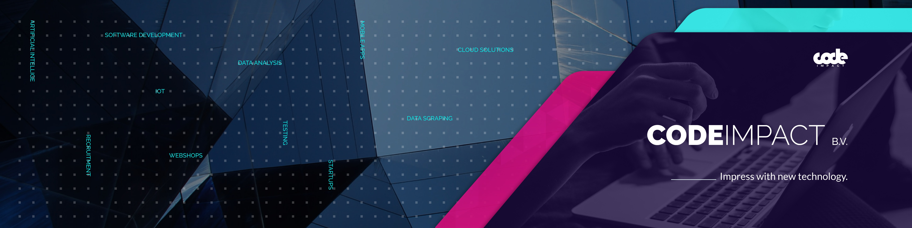

# CodeImpact

  

CodeImpact is a Netherlands-based software and recruitment agency dedicated to helping brands achieve growth, reduce costs, and develop enterprise solutions utilizing the latest technologies. Our motto, "The web is our playground," reflects our passion for merging talent and technology to produce impressive results.

With years of experience in software engineering, project management, and talent acquisition, we specialize in developing e-commerce systems, CRM systems, mobile applications, and custom applications for various industries, including education, healthcare, fintech, e-commerce, and telco.

We are particularly skilled in game development, VR, and XR. Our diverse team oversees the entire process from A to Z, including manual and automatic quality assurance, building pipelines to generate software quality reports, scanning for vulnerabilities and potential security threats, and deploying applications to popular cloud platforms like AWS, Google, or Microsoft Azure.

Whether you need a web application or an application requiring zero downtime, we specialize in Kubernetes to ensure seamless performance. Our remote dedicated team comprises language experts in Java, PHP, Javascript, NodeJS, C++, and C#, as well as frameworks such as Vue, Laravel, Symfony, Angular, React, and Spring Boot.

We also excel in working with big data loads where handling high traffic is crucial, message systems such as Kafka, creating mathematical formulas to optimize business processes, financial reporting, and stock market analysis. Additionally, we are passionate about designing secure environments in the cloud.

At CodeImpact, we are dedicated to extending your team with our top professionals to unlock your business's full potential.

- [LinkedIn](https://www.linkedin.com/company/codeimpact/)
- [Website](https://www.codeimpact.nl)

## My Experience
- Developed <b>VR</b> and <b>Game</b> applications for the <b>Oculus Quest</b>.
- Modified the <b>Oculus Integration API</b> to improve the functionality of certain game features.
- Gained experience using <b>Profiling tools</b> to identify and fix complex behavioral and performance issues.
- Built and maintained <b>Unity Custom Packages</b> to speed up and simplify development.